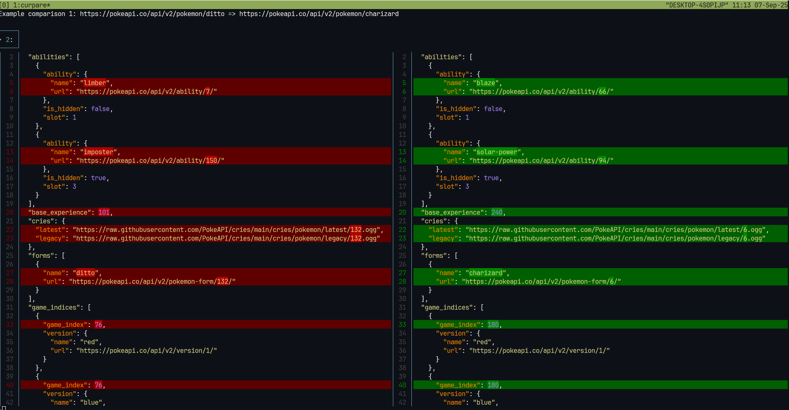

# Curpare

Curpare is a powerful tool designed to compare the return values, status codes, and bodies of JSON APIs seamlessly. It leverages [git-delta](https://github.com/dandavison/delta) to present the output in a clear and user-friendly manner. With Curpare, you can define multiple API endpoints to compare, utilize environment variables, and specify various options for each comparison.

# Example using Pokemon API



## Features

- **Flexible TOML Configuration**: Define as many API links as you wish in a TOML format. Each comparison can be customized with specific options.
- **Caching System**: Caching System: Cache the API calls by caching them to avoid unnecessary API calls. You can utilize the cache system to compare the same API by caching a call and checking it against a live version of the same API. This will make sure you can focus on making progress while having a backup test to see the changes in seconds.
- **Multiple Cache Versions**: Each cached response is stored in its own JSON file within the cache directory, enabling you to maintain multiple versions of the same API for comparison.
- **Ignore Lines**: Specify lines to ignore during comparisons, making it easier to focus on relevant differences.
- **Environment Variables**: Use environment variables in your TOML configuration for dynamic URL resolution.

## Installation

### Requirements

To get started with Curpare, ensure you have [git delta](https://github.com/dandavison/delta) installed. Here is a link to the installation page https://dandavison.github.io/delta/installation.html.

### Installing

If you have `cargo` you can install it using `cargo install curpare`
Or you can download one of the already pre-compiled versions if its available to your OS. Otherwise currently you will have to compile it from source using `cargo`

## Usage

To use Curpare, run the following command:

curpare [OPTIONS] <PATH>

### Arguments

- `<PATH>`: Path to the TOML file containing the URL configurations. The configuration should be a map of a list of requests, each with a name and an object containing left and right comparisons.

### TOML Configuration Format

The TOML configuration example with only mandatory fields making two requests comparison:
```toml
[[requests]]
name = "Example comparison 1"
[requests.left]
url = "https://pokeapi.co/api/v2/pokemon/ditto"
[requests.right]
url = "https://pokeapi.co/api/v2/pokemon/charizard"

[[requests]]
name = "Example comparison 2"
[requests.left]
url = "https://pokeapi.co/api/v2/pokemon/squirtle"
[requests.right]
url = "https://pokeapi.co/api/v2/pokemon/ivysaur"
```

More Fields example

```toml
ignore_lines = []

[[requests]]
name = "Example comparison 1"
ignore_lines = []

[requests.left]
url = "http://localhost:5000/data"
cached = false
method = "GET"

[requests.left.headers]
Accept = "application/json"

[requests.left.basic_auth]
username = "example"
password = "example1234"

[requests.left.query]
limit = "10"
sort = "desc"

[requests.right]
url = "http://localhost:5000/data"
ignore_lines = []
cached = false
method = "GET"

[requests.right.headers]
Accept = "application/json"
Bearer = "jhdsn3qe2w784yn0n3"

[requests.right.query]
sort = "desc"
```

### Environmental Variables

You can use environmental variables in your TOML configuration. To do this, wrap the variable in `${}`. For example, if you have an environmental variable `HOST=https://google.com`, you can use it in your TOML as follows:

url: "${HOST}/query"

### Options

- `-c`, `--clear-cache`: Clear old cache for this TOML configuration.
- `-o`, `--out`: Choose a path file to generate a TOML configuration that will only contain the requests which had differences
- `-a`, `--all-cache`: Cache all calls for this TOML configuration.
- `-n`, `--no-cache`: Do not use cache for any calls for this TOML configuration.
- `-i`, `--skip-ignore`: Skip all ignore lines during comparison.
- `--cache-only`: Will only fill the caches without showing any differences at the end. NOTE: will not clear the cache, only update it if URLs not already cached
- `-h`, `--help`: Print help information.
- `-V`, `--version`: Print the version of Curpare.

## Example

To compare two APIs, create a TOML configuration file (e.g., `config.toml`) and run:

```bash
curpare config.toml
```

This will execute the comparisons defined in your JSON file and display the results using `git-delta`.

## Conclusion

Curpare is an essential tool for developers and testers who need to compare API responses efficiently. With its caching system, flexible configuration, and clear output, it simplifies the process of API testing and validation. For more information, check the documentation or explore the source code on GitHub.
